This is a note on basic property changes for the remaster. Might be useful if you just need to do small changes like weight/cost/enchantments. Don't change names using this method, as AltarESPMain.esp changes all the names in the game to be localization strings that are managed by UE5 side.

# Instructions
1. Install the latest xEdit (4.1.5n as of this guide) from [their Discord server](https://discord.com/invite/5t8RnNQ). Installation folder does not matter, as long as you don't lose it.
2. Boot up xEdit with next arguments:
   `xEdit.exe -TES4R -D:"C:\path\to\OblivionRemastered\Content\Dev\ObvData\Data\" -I:"C:\path\to\OblivionRemastered\Content\Dev\ObvData\Oblivion.ini"`
   -D is the location of Data folder, -I is the location of Oblivion.ini, -TES4R - makes xEdit aware it's remaster.
3. Load Oblivion.esm and all the DLC files.
   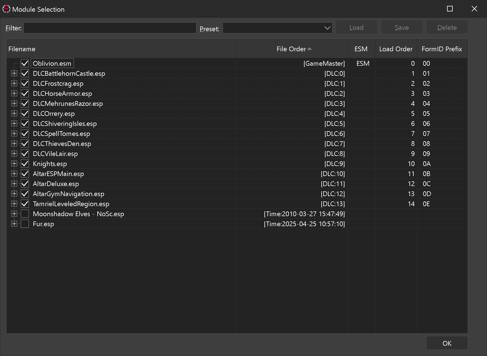
4. Wait for all the files to load through.
   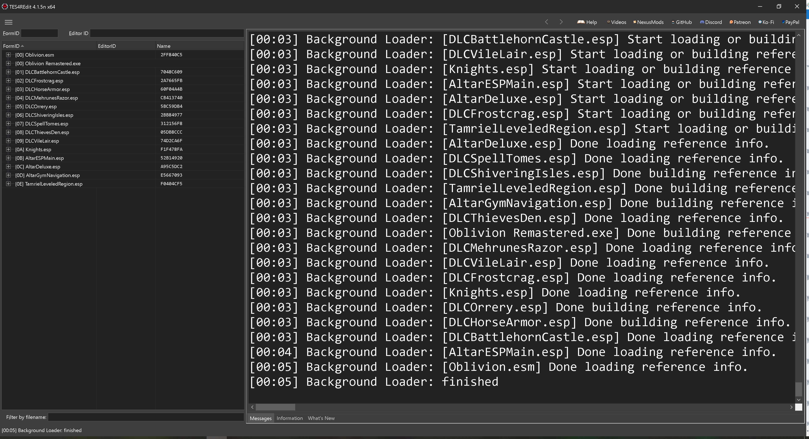
5. Open up the AltarESPMain.esp (on the left) and find the item you want to change. In our case it's an iron shield. Right click the item you want to change and select "Copy as new record into..."
   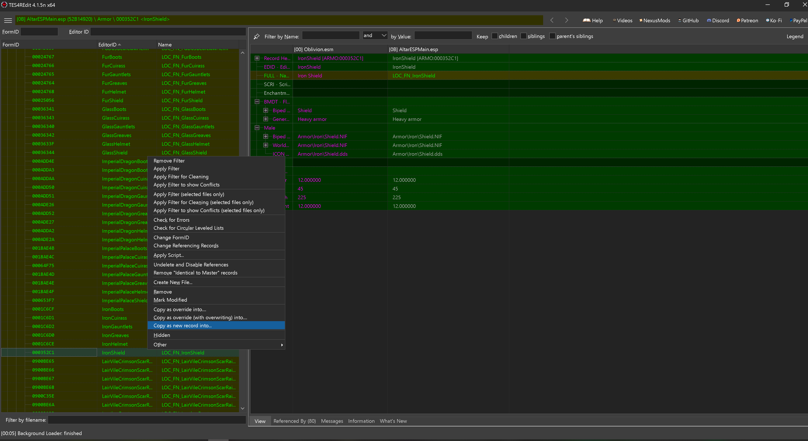
6. Confirm that you know what you're doing.
   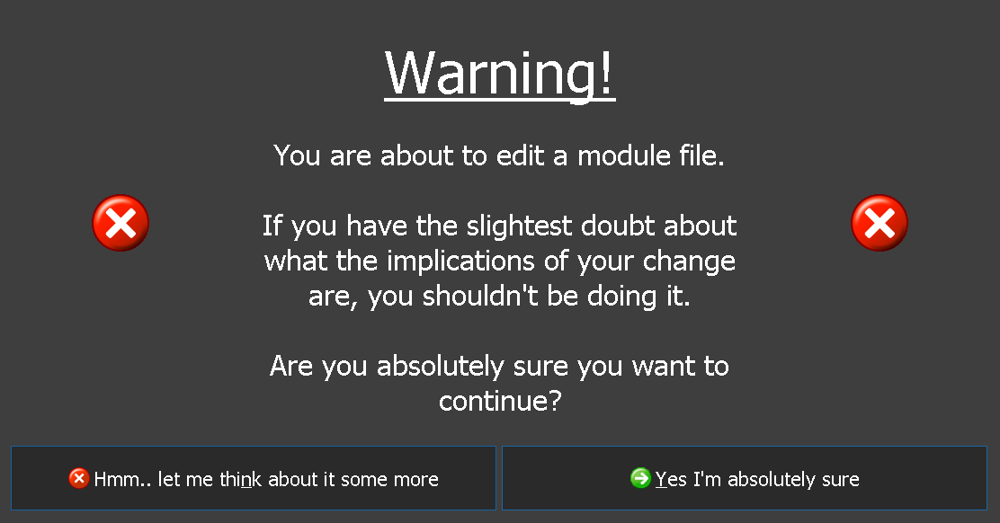
7. Change the EditorID of the item so it wouldn't conflict. 
   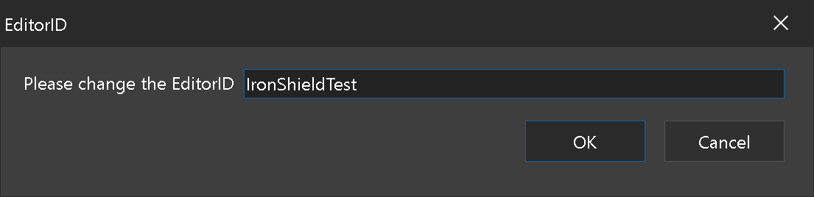
8. Select a new .esp file here - we don't want to change the original files.
   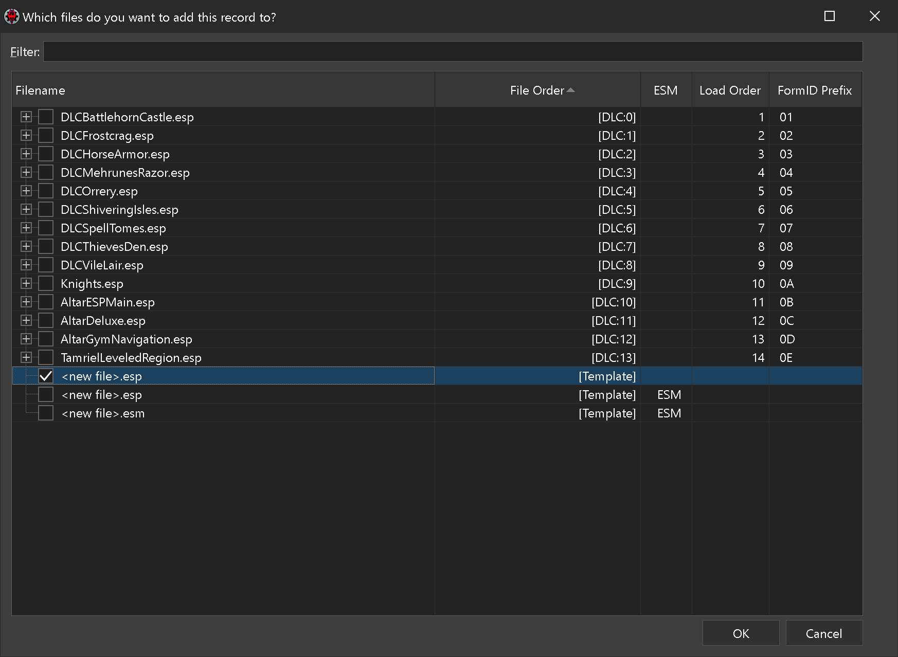
9. Pick a new name for your mod.
   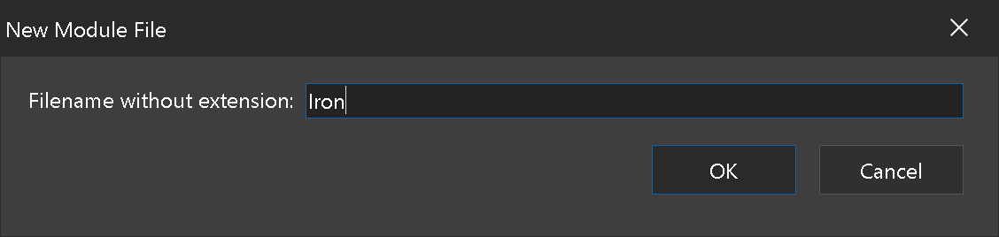
10.  Find your new item and do all the changes you need in DATA section.
    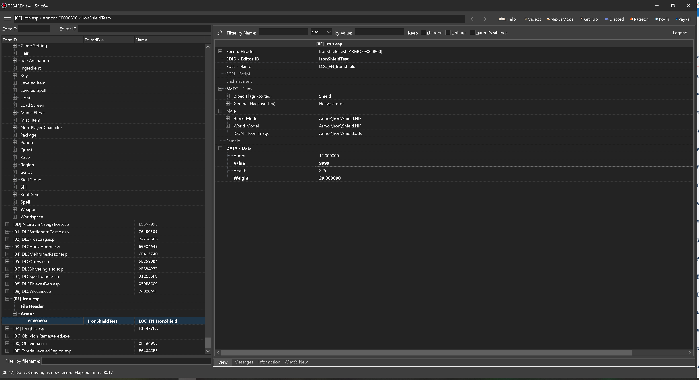
11. Return to AltarESPMain.esp records and go to Container section. Find a container you'll find easily. (for example, the Arena chest). Right click the chest and select "Copy as override into..."
    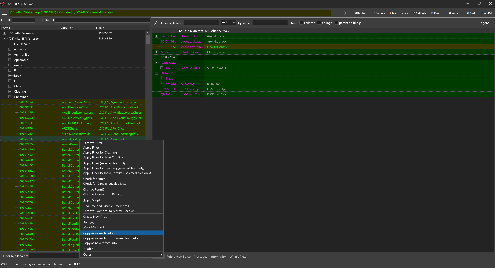
12. Select your new .esp file as the destination.
    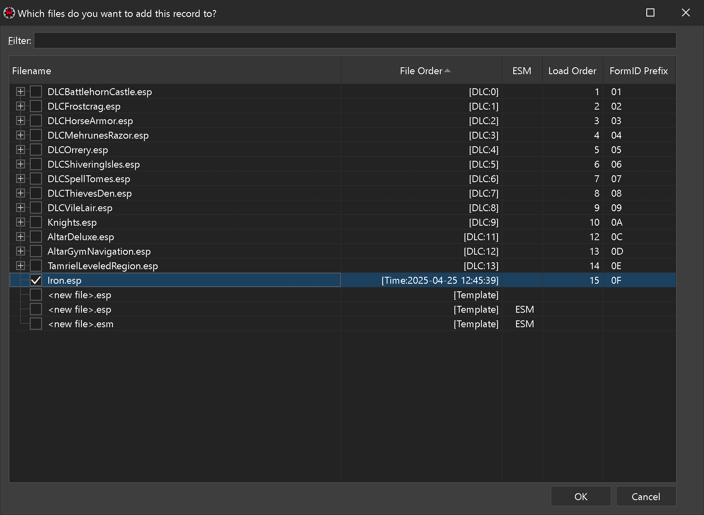
13. Confirm.
    
    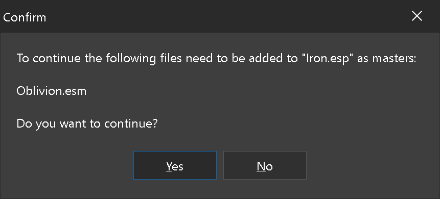
14. Navigate to your container in your .esp file. Pick Items tab and right click, pick "Add item".
    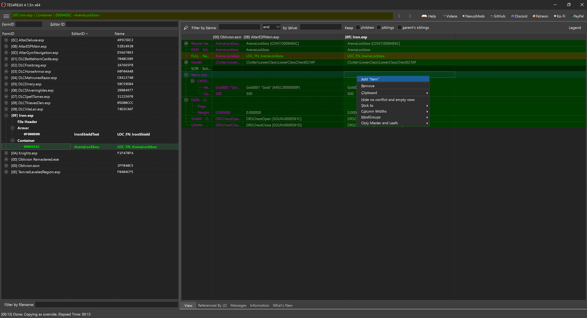
15. Find your item you just updated.
    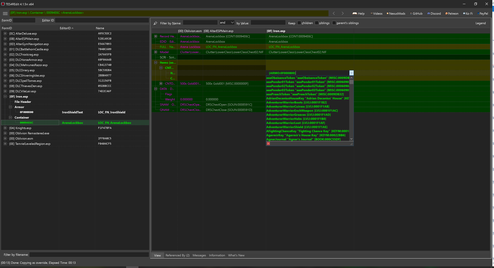
    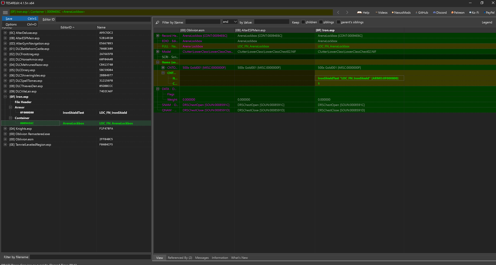
16. Save your file.
    
    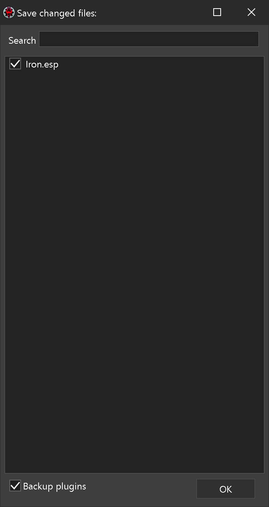
17. Enable your plugin in ObvData/Data/plugins.txt.
18. Test.

# Credits
silvist for screenshots